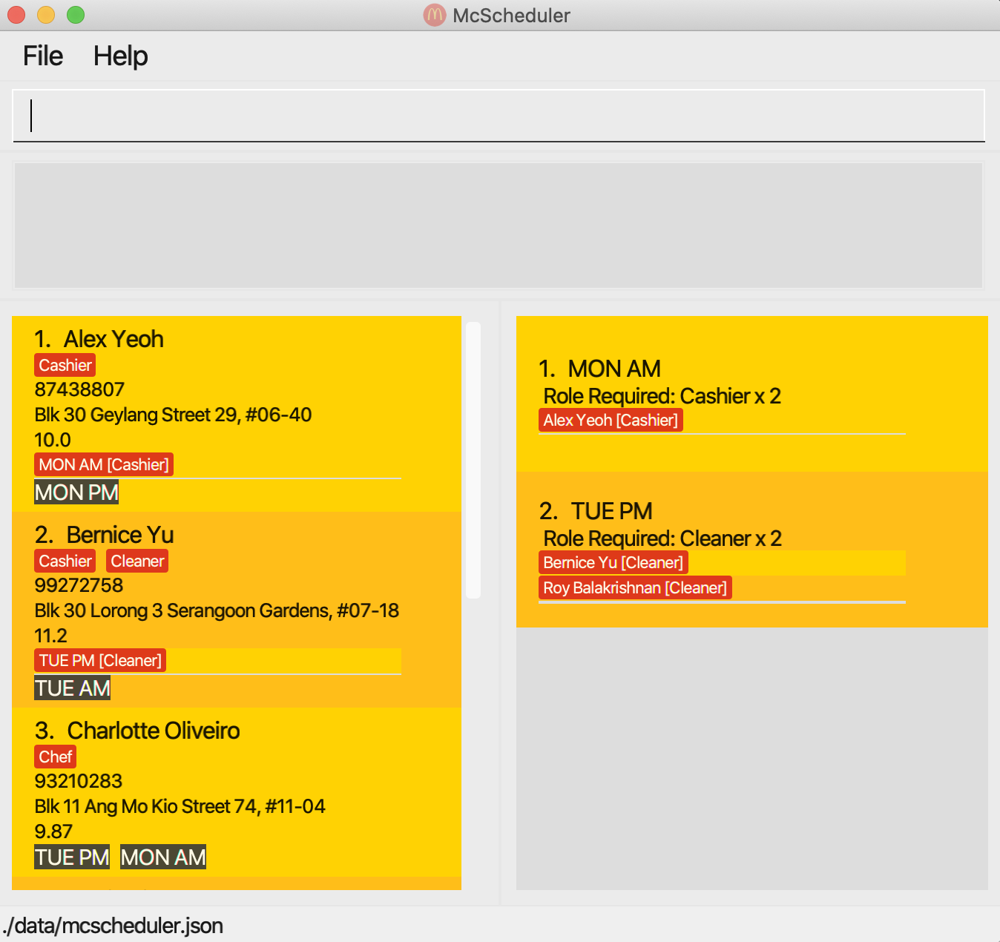

# McScheduler

McScheduler is a **one-stop solution for McDonald's Shift Managers to manage shift scheduling and worker
contact/compensation, optimized for use via a Command Line Interface** (CLI) while still having the benefits of a
Graphical User Interface (GUI).

With the McScheduler, McDonald's Shift Managers can easily access all information needed for shift-work assignment.

This is a team brownfield project, developed during a Software Engineering introductory module.

For the detailed documentation of this project, see the **[McScheduler Product Website](https://ay2021s1-cs2103-f10-4.github.io/tp/)**.

## Acknowledgements
* This project is based on the *AddressBook-Level3* project created by the [SE-EDU initiative](https://se-education.org).
* McDonald's, its logo, and its Jingle are owned by the McDonald's Corporation. This app and the team are not affiliated to McDonald's in any way. 
