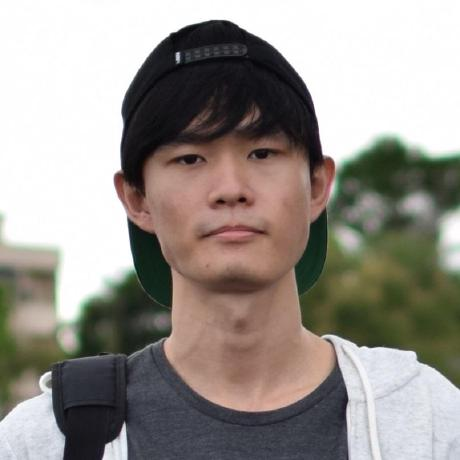

We are a team based in the [School of Computing, National University of Singapore](http://www.comp.nus.edu.sg).

## Project team

### Foo Kai En

[[github](https://github.com/wakululuu)]
[[portfolio](team/wakululuu.md)]

Email: [kaien.foo@u.nus.edu](mailto:kaien.foo@u.nus.edu)

* Role: Developer
* Responsibilities: Code quality, testing (secondary)

### Guo Bohao

[[github](http://github.com/plosslaw)]
[[portfolio](team/plosslaw.md)]

Email: [bohao.guo@u.nus.edu](mailto:bohao.guo@u.nus.edu)

* Role: Developer
* Responsibilities: Testing

### Sigmund Chianasta

[[github](http://github.com/sigmund-c)] [[portfolio](team/sigmund-c.md)]

Email: [sigmund@u.nus.edu](mailto:sigmund@u.nus.edu)

* Role: Developer, Coordinator
* Responsibilities: Refactoring, Issue tracking
 

### Tan Su Yin

[[github](http://github.com/tnsyn)]
[[portfolio](team/tnsyn.md)]

Email: [tansuyin@u.nus.edu](mailto:tansuyin@u.nus.edu)

* Role: Developer
* Responsibilities: Integration

### Wang Zijun

[[github](http://github.com/WangZijun97)]
[[portfolio](team/wangzijun97.md)]

Email: [w.zijun@u.nus.edu](mailto:w.zijun@u.nus.edu)

* Role: Developer
* Responsibilities: Documentation
