* Table of Contents
{:toc}

--------------------------------------------------------------------------------------------------------------------

## **Setting up, getting started**

Refer to the guide [_Setting up and getting started_](SettingUp.md).

--------------------------------------------------------------------------------------------------------------------

## **Design**

### Architecture

The ***Architecture Diagram*** given above explains the high-level design of the App. Given below is a quick overview of each component.

:bulb: **Tip:** The `.puml` files used to create diagrams in this document can be found in the [diagrams](https://github.com/AY2021S1-CS2103-F10-4/tp/tree/master/docs/diagrams) folder.
Refer to the [_PlantUML Tutorial_ at se-edu/guides](https://se-education.org/guides/tutorials/plantUml.html) to learn how to create and edit diagrams.

**`Main`** has two classes called [`Main`](https://github.com/AY2021S1-CS2103-F10-4/tp/blob/master/src/main/java/mcscheduler/Main.java)
and [`MainApp`](https://github.com/AY2021S1-CS2103-F10-4/tp/blob/master/src/main/java/mcscheduler/MainApp.java). It is responsible for,

* At app launch: Initializes the components in the correct sequence, and connects them up with each other.
* At shut down: Shuts down the components and invokes cleanup methods where necessary.

[**`Commons`**](#common-classes) represents a collection of classes used by multiple other components.

The rest of the App consists of four components.

* [**`UI`**](#ui-component): The UI of the App.
* [**`Logic`**](#logic-component): The command executor.
* [**`Model`**](#model-component): Holds the data of the App in memory.
* [**`Storage`**](#storage-component): Reads data from, and writes data to, the hard disk.

Each of the four components,

* defines its *API* in an `interface` with the same name as the Component.
* exposes its functionality using a concrete `{Component Name}Manager` class (which implements the corresponding API `interface` mentioned in the previous point.

For example, the `Logic` component (see the class diagram given below) defines its API in the `Logic.java` interface and exposes its functionality using the `LogicManager.java` class which implements the `Logic` interface.

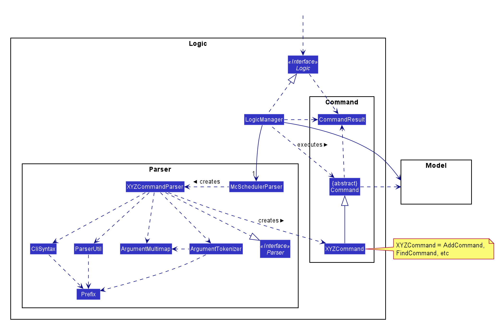

**How the architecture components interact with each other**

The *Sequence Diagram* below shows how the components interact with each other for the scenario where the user issues the command `worker-delete 1`.

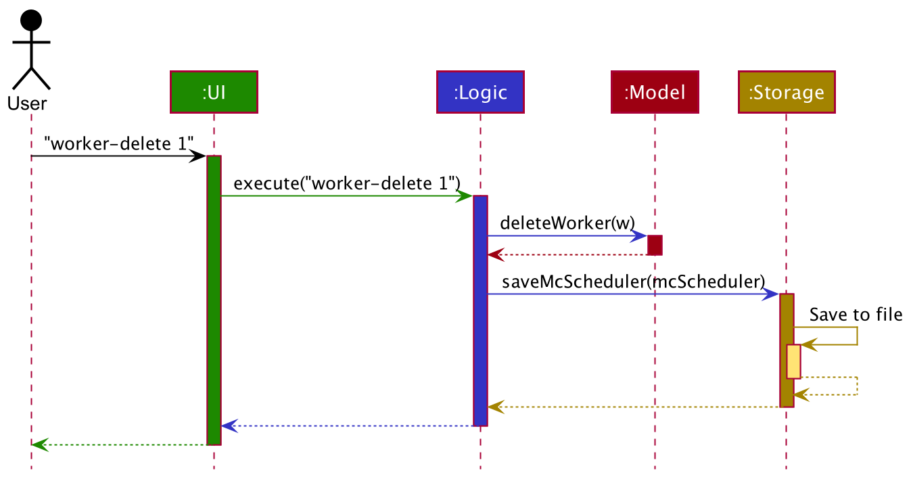

The sections below give more details of each component.

### UI component

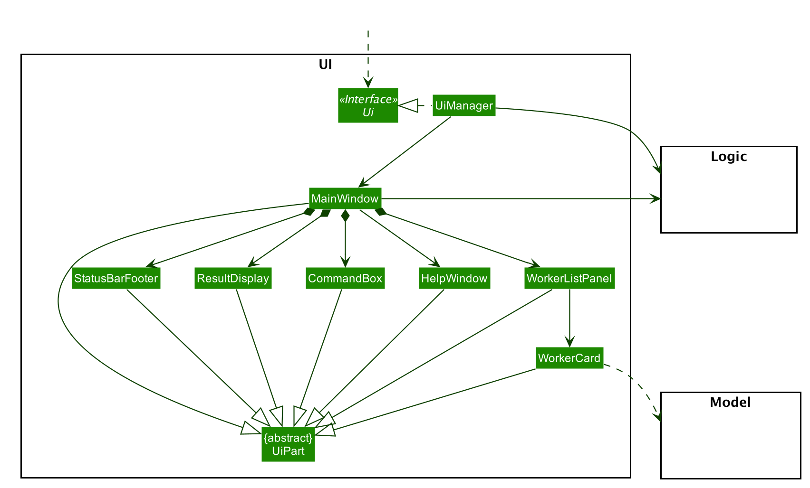

**API** :
[`Ui.java`](https://github.com/AY2021S1-CS2103-F10-4/tp/blob/master/src/main/java/mcscheduler/ui/Ui.java)

The UI consists of a `MainWindow` that is made up of parts e.g.`CommandBox`, `ResultDisplay`, `WorkerListPanel`, `StatusBarFooter` etc. All these, including the `MainWindow`, inherit from the abstract `UiPart` class.

The `UI` component uses JavaFx UI framework. The layout of these UI parts are defined in matching `.fxml` files that are in the `src/main/resources/view` folder. For example, the layout of the [`MainWindow`](https://github.com/AY2021S1-CS2103-F10-4/tp/blob/master/src/main/java/mcscheduler/ui/MainWindow.java) is specified in [`MainWindow.fxml`](https://github.com/AY2021S1-CS2103-F10-4/tp/blob/master/src/main/resources/view/MainWindow.fxml)

The `UI` component,

* Executes user commands using the `Logic` component.
* Listens for changes to `Model` data so that the UI can be updated with the modified data.

### Logic component

**API** :
[`Logic.java`](https://github.com/AY2021S1-CS2103-F10-4/tp/blob/master/src/main/java/mcscheduler/logic/Logic.java)

1. `Logic` uses the `McSchedulerParser` class to parse the user command.
1. This results in a `Command` object which is executed by the `LogicManager`.
1. The command execution can affect the `Model` (e.g. adding a worker).
1. The result of the command execution is encapsulated as a `CommandResult` object which is passed back to the `Ui`.
1. In addition, the `CommandResult` object can also instruct the `Ui` to perform certain actions, such as displaying help to the user.

Given below is the Sequence Diagram for interactions within the `Logic` component for the `execute("worker-delete 1")` API call.

:information_source: **Note:** The lifeline for `WorkerDeleteCommandParser`should end at the destroy marker (X) but due to a limitation of PlantUML, the lifeline reaches the end of diagram.

### Model component

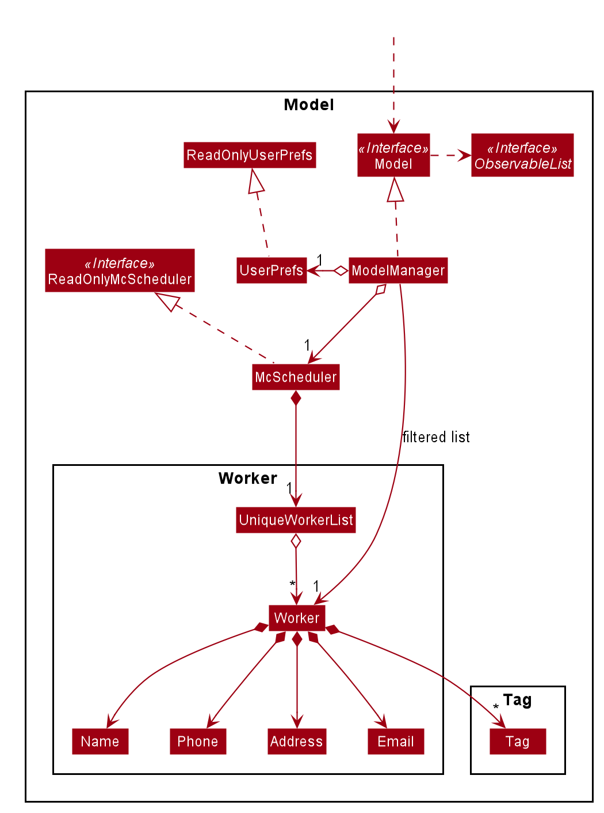

**API** : [`Model.java`](https://github.com/AY2021S1-CS2103-F10-4/tp/blob/master/src/main/java/mcscheduler/model/Model.java)

The `Model`,

* stores a `UserPref` object that represents the user’s preferences.
* stores the mcsheduler data.
* exposes an unmodifiable `ObservableList<Worker>` and `ObservableList<Role>` that can be 'observed' e.g. the UI can be
bound to these lists so that the UI automatically updates when the data in the lists change.
* does not depend on any of the other three components.

### Storage component

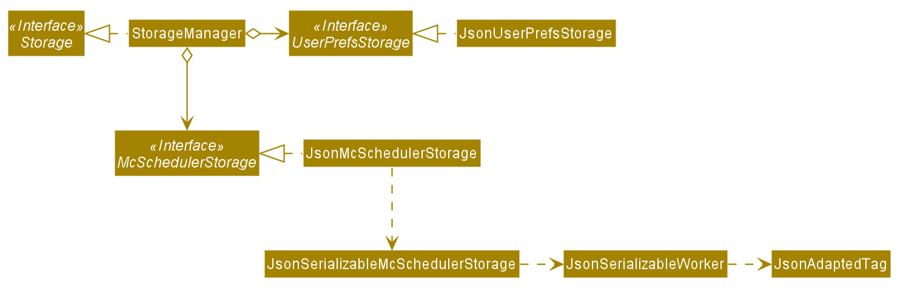

**API** : [`Storage.java`](https://github.com/AY2021S1-CS2103-F10-4/tp/blob/master/src/main/java/mcscheduler/storage/Storage.java)

The `Storage` component,
* can save `UserPref` objects in json format and read it back.
* can save the mcscheduler data in json format and read it back.

### Common classes

Classes used by multiple components are in the `mcscheduler.commons` package.

--------------------------------------------------------------------------------------------------------------------

## **Implementation**

This section describes some noteworthy details on how certain features are implemented.

### Worker feature

The adding of workers is core to the functionality of the system. Users are able to add important information to each
worker, which will help them assign workers to shifts they are most suited for.

#### Implementation

The mechanism for adding a worker is facilitated by a `Worker` class. A `Worker` has a `Name`, a
`Phone`, a `Pay`, an optional `Role` set and an optional `Unavailability` set.

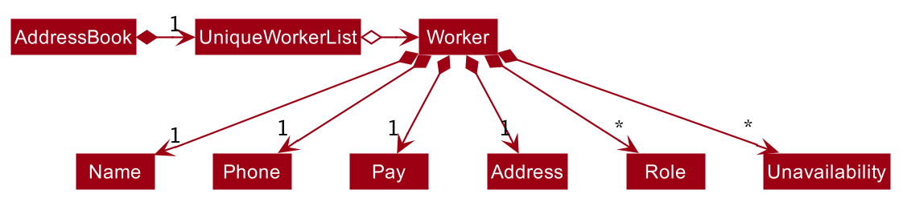

A user can add a `Worker` to the `McScheduler` by running a `worker-add` command. 

#### Example usage scenario

Given below is an example usage scenario and how the `worker-add` feature behaves at each step after the user has
launched the application.

Step 1. The user executes the command `worker-add n/John hp/98765432 p/9.0 a/400 Scheduler Lane`. `McSchedulerParser`
creates a `WorkerAddCommandParser` and calls the `WorkerAddCommandParser#parse()` method.

Step 2. The fields `n/`, `hp/`, `p/`, and `a/` are parsed within `WorkerAddCommandParser#parse()` and an instance of
`Name`, `Phone`, `Pay` and `Address` are created respectively. These objects are passed as arguments to the `Worker`
constructor and a new `Worker` object is created.

Step 3. A `WorkerAddCommand` with the created `Worker` object as an argument is returned to the `LogicManager` and
executed. The `Worker` object is added to and stored inside the `Model`.

The following sequence diagram shows how `Worker` is added.

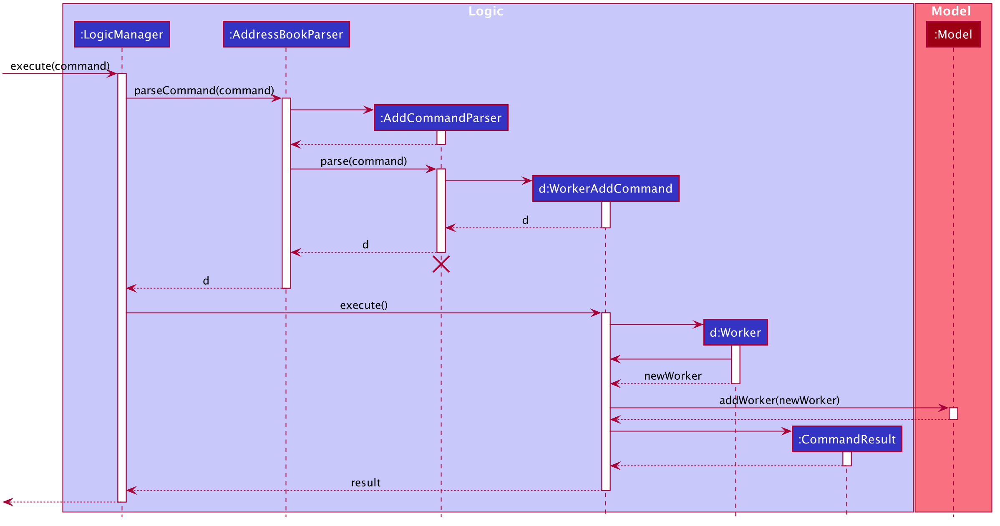

:information_source: **Note:** The lifeline for `WorkerAddCommandParser` should end at the destroy marker (X) but due to a limitation of PlantUML, the lifeline reaches the end of diagram.

### Shift feature

Similar to workers, adding and manipulating shifts is a key functionality of the McScheduler. Users will be able to add
role requirements to shifts, assign workers to shifts and assign workers to take leave for a shift. 

#### Implementation

Shifts are represented by the `Shift` class. It contains important details related to shifts such as the day (through `ShiftDay`),
the time (through `ShiftTime`) and role requirements (through `RoleRequirement`) of the shift. A `RoleRequirement` object
details how many workers are needed to fill which roles in a given shift.

The following diagram details `Shift` and how it is represented in the App model.

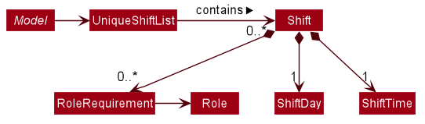

#### Commands

The following commands have been implemented to work with `Shift`:
- `ShiftAddCommand` to add new shifts
- `ShiftEditCommand` to edit existing shifts
- `ShiftDeleteCommand` to delete existing shifts

These commands work similarly to the `Worker` based commands.

#### Example usage scenario

Given below is an example usage scenario and how the `shift-edit` feature works at each step.

Step 1. User enters the command `shift-edit 2 d/FRI`. `McSchedulerParser` creates a `ShiftEditCommandParser` and calls
the `ShiftEditCommandParser#parser()` method.

Step 2. The preamble index and field `d/` are parsed within `ShiftEditCommandParser#parser()` and creates an instance of
`ShiftEditCommandParser` then creates a `ShiftEditDescriptor` with a new `ShiftDay`. Should there be other optional fields
such as `ShiftTime` or `RoleRequirement` as requested by the uder in their command, similar instances will be created and added
to the `ShiftEditDescriptor`.

Step 3. A `ShiftEditCommand` with the `ShiftEditDescriptor` and the index of the `Shift` of interest is returned and executed,
setting the edited shift within the model. This results in the replacement of the `Shift` object within the model with a newly
created `Shift` object based on the new attributes.

The following sequence diagram demonstrates this editing process (as per the example).

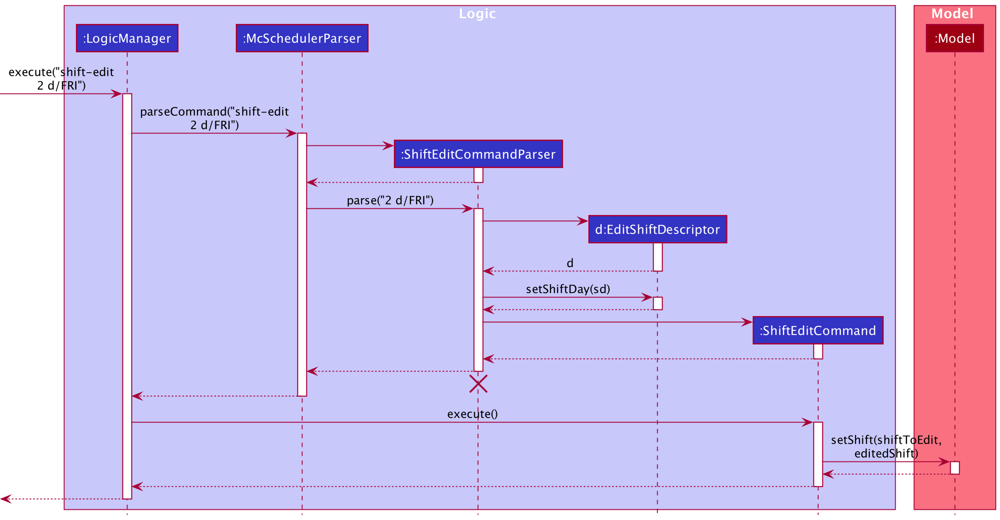

:information_source: **Note:** The lifeline for `ShiftEditCommandParser` should end at the destroy marker (X) but due to a limitation of PlantUML, the lifeline reaches the end of diagram.

Should there be other information to be edited as requested by the user, there will be other objects created besides `ShiftDay`.

### Unavailability feature

The unavailability feature allows users to add unavailable timings to a `Worker`, which comprise a day and/or a time.
The setting prevents workers from being assigned to shift slots that they are unavailable for.

#### Implementation

The proposed mechanism is facilitated by `ParserUtil` and the existing system for adding and editing workers.

#### Unavailability

Unavailability is represented by an `Unavailability` class. Since a worker's unavailable timings are only relevant
in the context of existing shift slots, `Unavailability` contains a `ShiftDay` and a `ShiftTime`.

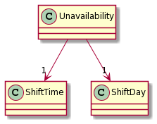

Instances of `Unavailability` can be created on 2 occasions:

1. During a `worker-add` command, prefixed with `u/`
2. During a `worker-edit` command, prefixed with `u/`

To increase the efficiency of adding a worker's unavailable timings, users may type `u/UNAVAILABILITY_DAY` to indicate a full-day unavailability 
instead of typing `u/UNAVAILABILITY_DAY AM` and `u/UNAVAILABILITY_DAY PM` separately. Functionality has been added to support the creation
of an AM `Unavailability` and a PM `Unavailability` when `u/UNAVAILABILITY_DAY` is entered. The `ParserUtil` class supports this during parsing through:

- `ParserUtil#parseUnavailability()` — Parses a String and creates a valid `Unavailability` object
- `ParserUtil#createMorningUnavailabilityString()` — Generates a String of the format `UNAVAILABILITY_DAY AM`
- `ParserUtil#createAfternoonUnavailabilityString()` — Generates a String of the format `UNAVAILABILITY_DAY PM`
- `ParserUtil#parseUnavailabilities()` — Iterates through a collection of Strings and creates an `Unavailability`
object for each

#### Example usage scenario

Given below is an example usage scenario and how the unavailability feature behaves at each step after the user has
launched the application.

Step 1. The user executes a `worker-add` command `worker-add ... u/Mon`. `McSchedulerParser` creates a
`WorkerAddCommandParser` and calls the `WorkerAddCommandParser#parse()` method.

Step 2. Within `WorkerAddCommandParser#parse()`, `ParserUtil#parseUnavailabilities()` is called to generate an
`Unavailability` set from the given `u/Mon` field. `ParserUtil#parseUnavailabilities()` checks whether
the input contains only 1 keyword. In this case, since only 1 keyword (i.e. `Mon`) is present, `ParserUtil#createMorningUnavailabilityString()`
is called to generate a `Mon AM` String and `ParserUtil#createAfternoonUnavailabilityString()` is called to generate a `Mon PM`
String. Inside `ParserUtil#parseUnavailabilities()`, `ParserUtil#parseUnavailability()` is called on both Strings
and 2 valid `Unavailability` objects are created, before being added to the returnable `Unavailability` set.

Step 3. The `Unavailability` set is passed into the constructor of the `Worker` class to instantiate a `Worker` object
with the unavailable timings `Mon AM` and `Mon PM`.

The following sequence diagram shows how unavailable timings are added to a `Worker`.

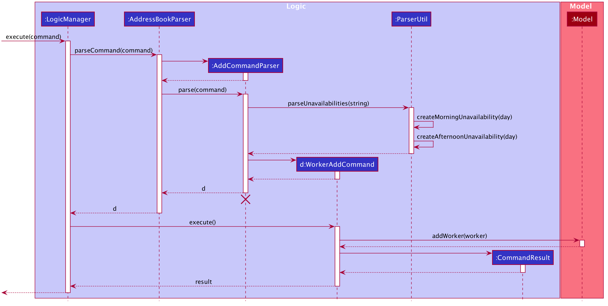

:information_source: **Note:** The lifeline for `WorkerAddCommandParser` should end at the destroy marker (X) but due to a limitation of PlantUML, the lifeline reaches the end of diagram.

### Assign/unassign feature

The assign/unassign feature allows the user to assign/unassign a worker to/from a role in a shift.

#### Implementation

This mechanism is facilitated by adding/deleting `Assignment` objects in the `McScheduler`. Each `Assignment` object
stores a `Shift`, `Worker` and `Role` object. The `McScheduler` maintains a `UniqueAssignmentList`, which enforces
uniqueness between `Assignment` objects by comparing them using `Assignment#isSameAssignment(Assignment)`.

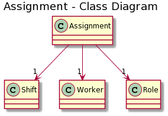

The operations supporting the adding/deleting of `Assignment` objects are exposed in the `Model` interface as
`Model#addAssignment(Assignment)` and `Model#deleteAssignment(Assignment)`.

#### Example usage scenario

Step 1. The user executes `assign s/1 w/1 Cashier` to assign the 1st worker the role of a cashier in the 1st shift in
the McScheduler. `McSchedulerParser` creates an `AssignCommandParser` and calls the `AssignCommandParser#parse()` method.

Step 2. The fields `s/` and `w/` are parsed by the `AssignCommandParser`. A `shiftIndex` and `Set<WorkerRolePair>`
object are created respectively and passed as arguments into the `AssignCommand` constructor. The created `AssignCommand`
is executed in the `LogicManager` by calling the `AssignCommand#execute()` method.

Step 3. During the execution of the `AssignCommand`, an `Assignment` object, storing the 1st `Shift`, 1st `Worker` and cashier
`Role` objects, is created. The `Assignment` object is then added to the `UniqueAssignmentList` in the `Model`.

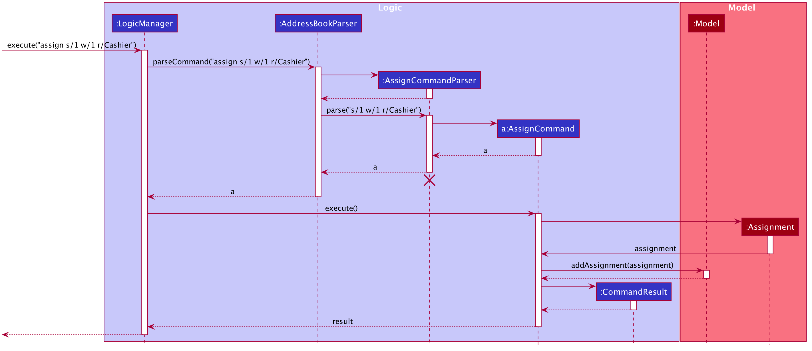

:information_source: **Note:** The lifeline for `AssignCommandParser` should end at the destroy marker (X) but due to a limitation of PlantUML, the lifeline reaches the end of diagram.

Step 4. The user realises the previous command was a mistake and executes `unassign s/1 w/1` to unassign the 1st worker
from the 1st shift in the McScheduler. The `unassign` command recreates the `Assignment` object to be deleted and uses it
 as an identifier to identify the `assignment` to be deleted from the `UniqueAssignmentList` in the `Model`.

### Role feature

The role feature allows users to add roles to a `Worker` and add `RoleRequirement` to a `Shift`. When assigning a `Worker` to a `Shift` under a particular `Role`,
we check that the `Worker` has the corresponding `Role` tagged to the `Worker` as the `Role` in the `RoleRequirement` of the particular `Shift`.

#### Implementation

The `Role` constructor takes in a `String` and creates a `Role` object with the according `roleName`. When tagging a `Worker` with a `Role`, we check that the `Role` is an allowed `Role` by checking if it exists in the 
`UniqueRoleList` of the McScheduler.

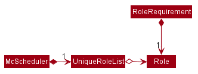

#### Commands
The following commands have been implemented to work with `Role`:
- `RoleAddCommand` to add new roles to `UniqueRoleList`
- `RoleDeleteCommand` to delete existing roles in `UniqueRoleList`
- `RoleListCommand` to list existing roles in `UniqueRoleList`

#### Example usage scenario

Step 1. The user executes `role-add Cashier` to add the cashier role to the `UniqueRoleList` in the McScheduler `ModelManager`.
If the role being added already exists in the `UniqueRoleList`, `DuplicateRoleException` is thrown.

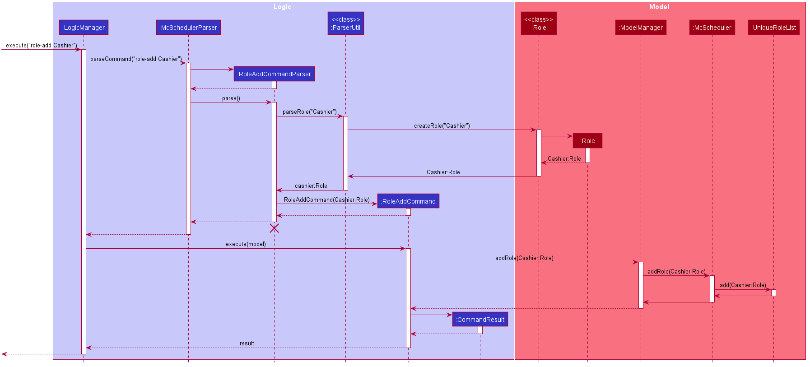

:information_source: **Note:** The lifeline for `RoleAddCommandParser` should end at the destroy marker (X) but due to a limitation of PlantUML, the lifeline reaches the end of diagram.

Step 2. The user realises the previous command was a mistake and looks at the Role list to get the index of the cashier role in the `UniqueRoleList`.
Using the role index in the `UniqueRoleList`, the user executes `role-delete ROLE_INDEX` to remove the cashier role from the `UniqueRoleList`.

### Take/cancel leave feature

The take/cancel leave feature allows users to set workers status to leave given a day and time. 
The setting prevents workers from being allocated to a work shift for which they are taking leave.

#### Implementation

The proposed mechanism to indicate that individuals are on leave makes use of the existing system for assigning workers
to shifts with a particular role. By making use of the existing assignment system, certain conflicts can be avoided:

- Assignment of a worker to a shift when they took leave for that shift will not result in two assignments to the same shift.

##### Leave

Leave is represented as an extension of `Role`. To prevent conflicts between `new Leave()` and `new Role("Leave")`,
these two objects are deemed equivalent through `Leave#equals()` and `Role#equals()`. This implementation should
be reconsidered if there should be a significant difference between these two objects.

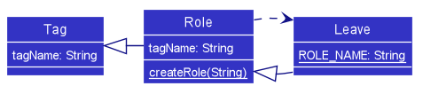

Due to their similarity, `Leave` objects are initiated using a common factory method as `Role` objects 
through `Role#createRole()`, which will parse the given input as a `Role` or a `Leave` respectively. 
This implementation prevents the creation of a role that has the same name as a leave.

To handle commands which should treat `Leave` differently as compared to other roles, `Leave#isLeave()` is provided.

##### Leave Assignment

Assignment makes use of the `Assignment` class features using `Leave` as the role.

##### Commands

Since `Leave` is essentially an extension of the assignment system, commands related to leave are very similar
to commands related to assignments.

- `TakeLeaveCommand` sets workers to take leave for specific shift. It is a wrapper for `AssignCommand` 
and `ReassignCommand`, depending on if the worker already is assigned for that shift. The following diagram demonstrates how this works.

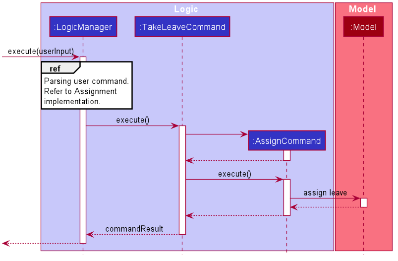

- `CancelLeaveCommand` is very similar to `UnassignCommand`. However, there is a need to check if the assignment being
removed represents a leave taken and not a normal role assignment. Hence, `CancelLeaveCommand` is implemented
separately and not as a wrapper. However, its implementation details is almost identical to `UnassignCommand`.

For more information, see [Implementation for Assign/Unassign Feature](#assignunassign-feature).

##### Mass Operation Commands

To increase the convenience of use for our expected typist user, we introduced a few mass operations related to leave:

- `TakeLeaveCommand` and `CancelLeaveCommand` both allow for many worker to one shift leave assignment similar to 
`AssignCommand` and `UnassignCommand`. See [MassOps Implementation Details](#massops-feature).
- `MassTakeLeaveCommand` and `MassCancelLeaveCommand` allow for one worker to many shift-leave assignment.
  - These two mass commands allow for taking leave over a range of days - similar to how leave is often planned 
  by workers.
  - These two commands do not require `Shift`s representing the range of days and times to take leave to be present. A bare-bones 
  `Shift` with only `ShiftDay` and `ShiftTime` will be initialised for each `Shift` that has no identity equivalent 
  (via `Shift#isSameShift()`) `Shift` present in the McScheduler.
  - The two commands handle other `Assignment`s differently:
    - `MassTakeLeaveCommand` informs the user after the command is complete if the worker is already scheduled for a shift 
  (i.e. a non-leave `Assignment`). The `Assignment` is replaced to indicate the leave taken.
    - `MassCancelLeaveCommand` searches for leaves in the datetime range and ignores non-leaves.
    
The following activity diagram describes the process behind `MassTakeLeaveCommand`.

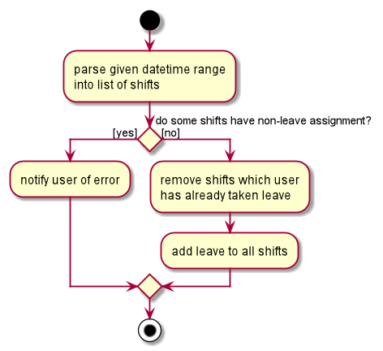

##### Future Extensions - Leave Quota

The following leave quotas could be implemented, possibly using the existing `RoleRequirement` class:

- Quota of leave per worker
- Quota of leave per shift

### MassOps Feature
For certain commands that will be frequently used (`assign`, `unassign`, `take-leave`, `cancel-leave`), mass
operations are supported to reduce the required number of command calls.
 
#### Implementation
These operations consist of their own `*Command` class and `*CommandParser` class. In each of the supported 
`*CommandParser class`, mass operations uses the `ArgumentMultimap#getAllValues(Prefix)` method, which parses the 
user input and returns all values that start with the specific prefix. In this case, the prefix is 'w/', 
signifying a `Worker`-`Role` relation.

Once the Command object has its `shiftIndex` and Set of `WorkerRole`, it creates individual `Assignment`s and adds
them to the Model.

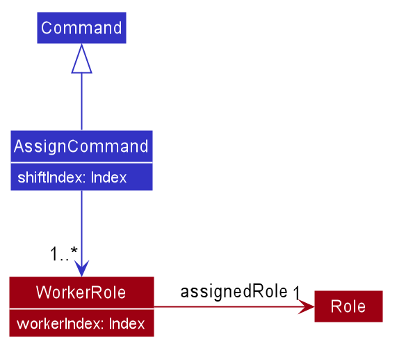

#### Example usage scenario
Let's say that the manager has a new Shift, and requires 3 of their existing staff members to work on 
that shift immediately.

Step 1. The manager creates a new Shift through the `shift-add` command if it was not already done.

Step 2. The manager calls `assign` to assign the 3 existing Workers to the Shift. 
eg. `assign s/8 w/2 Cashier w/3 Fry Cook w/7 Janitor` to assign Workers 2, 3, and 7 to the Role of Cashier, Fry Cook, 
and Janitor respectively to Shift 8.

Step 3. McScheduler parses the input and creates 3 `Assignment`s, which are then added to the `Model`:
* Shift 8, Worker 2, Cashier
* Shift 8, Worker 3, Fry Cook
* Shift 8, Worker 7, Janitor

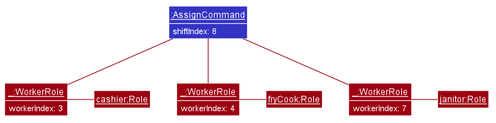

--------------------------------------------------------------------------------------------------------------------

## **Documentation, logging, testing, configuration, dev-ops**

* [Documentation guide](Documentation.md)
* [Testing guide](Testing.md)
* [Logging guide](Logging.md)
* [Configuration guide](Configuration.md)
* [DevOps guide](DevOps.md)

--------------------------------------------------------------------------------------------------------------------

## **Appendix: Requirements**

### Product scope

**Target user profile**:

* is a McDonald's shift manager in Singapore
* manages a significant number of worker contacts
* manages a large number of work shifts
* prefers desktop apps over other types
* can type fast
* prefers typing to mouse interactions
* is reasonably comfortable using CLI apps

**Value proposition**: McScheduler is a one-stop solution for McDonald's shift managers to manage shift scheduling, as
well as worker contacts and compensation. All relevant information is easily available to help streamline the management
process. It is also easy for the manager to contact workers, and manage their hours and pay. McScheduler aims to be faster than a
typical mouse/GUI driven app for fast typists.

### User stories

Priorities: High (must have) - `* * *`, Medium (nice to have) - `* *`, Low (unlikely to have) - `*`

#### Worker-related stories

* `* * *` As a user, I want to **add a new worker and their details**, so that I can track the worker's data and schedule their work
* `* * *` As a user, I want to **view a list of all workers**, so that I can know who are the workers I can assign shifts to

* [Epic] `* * *` As a user, I want to **view the details of a worker**
  * `* * *` As a user, I want to **view the contact details of workers**, so that I can contact them easily
  * `* * *` As a user, I want to **view the roles a worker can fill**, so that I can assign them a role they are fit for
  * `* * *` As a user, I want to **view the shifts a worker is unavailable or has taken leave for**, so that I can assign them only shifts they are available for
  * `* * *` As a user, I want to **view the shifts a worker is already assigned to**, so that I can assign them only shifts they have not been assigned to
  * `* *` As a user, I want to **find a specific worker among all other workers**, so that I can easily view their details without sieving through the whole list of workers
  * `* *` As a user, I want to **view the weekly pay of a worker**, so that I can compensate them accordingly
* `* *` As a user, I want to **edit the details of a worker**, so that I can have the most up-to-date information for shift scheduling and if I need to contact them
* `* * *` As a user, I want to **delete a worker**, so that I can remove a worker who has left McDonald's
* `*` As a user, I want to **see a worker's service rating**, so that I can decide who to give more work opportunities to

#### Shift-related stories

* `* * *` As a user, I want to **add a new shift**, so that I can assign workers to shifts
* `* * *` As a user, I want to **add roles and the respective quantities that need to be filled to a shift**, so that I can assign workers based on what is needed
* `* * *` As a user, I want to **view a list of all shifts**, so that I can have an overview of all the shifts I am managing
* [Epic] `* * *` As a user, I want to **view the details of a shift**
  * `* * *` As a user, I want to **view the roles and their quantities required in a shift**, so that I can assign workers based on what is needed
  * `* * *` As a user, I want to **view the workers already assigned to a shift and the role they are filling**, so that I can know which roles have yet to be filled
  * `* *` As a user, I want to **view all workers available to fill a role in a shift**, so that I can more easily assign workers shifts
  * `* *` As a user, I want to **find a specific shift among all other shifts**, so that I can easily view its details without sieving through the whole list of shifts
* `* *` As a user, I want to **edit the details of a shift**, so that I can reflect any changes in the timing, roles or number of workers needed for the shift
* `* * *` As a user, I want to **delete a shift**, so that I can remove an unwanted shift

#### Assignment-related stories

* `* * *` As a user, I want to **assign a worker to a role in a shift**, so that I can fill shift positions
* `* *` As a user, I want to **edit an existing assignment**, so that I can easily move workers around after assigning them to a role in a shift
* `* * *` As a user, I want to **unassign a worker from a shift**, so that I can update the quantity of the role that has been and has yet to be filled
* `* *` As a user, I want to **generate a weekly shift schedule**, so that I can see at a glance the workers assigned to every shift in the week

#### General stories

* `* *` As a new user, I want to **see sample data**, so that I can see what I can do with the app
* `* *` As a new user ready to add my own data, I want to **delete all sample data**, so that all data in the app is relevant to me
* `* *` As a new user, I want to **see a guide on how to use the key functions**, so that I can learn how to use the app
* `* *` As a user, I want to **see a summary of the various commands**, so that I can easily refer to it when I forget the exact format for the commands

_Some user stories are to be implemented beyond v1.4_

### Use cases

(For all use cases below, the **System** is the `McScheduler` and the **Actor** is the `user`, unless specified otherwise).

#### Use case: Add a worker (UC-001)

**MSS**

1. User requests to add worker.
2. McScheduler adds worker.

   Use case ends.

**Extensions**
* 1a. The given worker information has missing or wrong data.

    * 1a1. McScheduler shows an error message.

      Use case ends.

#### Use case: Delete a worker (UC-002)

**MSS**

1. User requests to list workers.
2. McScheduler shows a list of workers.
3. User requests to delete a specific worker in the list.
4. McScheduler deletes the worker.

   Use case ends.

**Extensions**

* 2a. The list is empty.

  Use case ends.

* 3a. The given index is invalid.

    * 3a1. McScheduler shows an error message.

      Use case resumes at step 2.
  
#### Use case: Edit a worker's information (UC-003)

**MSS**

1. User requests to list workers.
2. McScheduler shows a list of workers.
3. User requests to edit a specific worker in the list.
4. McScheduler edits the worker.

   Use case ends.

**Extensions**

* 2a. The list is empty.

  Use case ends.

* 3a. The given index is invalid.

    * 3a1. McScheduler shows an error message.

      Use case resumes at step 2.

* 3b. No information is given or the information is invalid.

    * 3b1. McScheduler shows an error message.

      Use case resumes at step 2.

#### Use case: Add a shift (UC-004)

**MSS**

1. User requests to add a shift.
2. McScheduler adds the shift.

   Use case ends.

**Extensions**

* 1a. The shift information is missing or invalid (wrong values).

    * 1a1. McScheduler shows an error message.

      Use case ends.
 
#### Use case: Delete a shift (UC-005)

**MSS**

1. User requests to list shifts.
2. McScheduler shows a list of shifts.
3. User requests to delete a specific shift on the list.
4. McScheduler deletes the shift.

**Extensions**

* 2a. The list is empty.

  Use case ends.

* 3a. The given index is invalid.

    * 3a1. McScheduler shows an error message.

      Use case resumes at step 2.

#### Use case: Edit a shift's information (UC-006)

**MSS**

1. User requests to list shifts.
2. McScheduler shows a list of shifts.
3. User requests to edit a specific shift in the list.
4. McScheduler edits the shift.

   Use case ends.

**Extensions**

* 2a. The list is empty.

  Use case ends.

* 3a. The given index is invalid.

    * 3a1. McScheduler shows an error message.

      Use case resumes at step 2.

* 3b. No information is given or the information is invalid.

    * 3b1. McScheduler shows an error message.

      Use case resumes at step 2.

#### Use case: Assign a worker to a shift (UC-007)

**MSS**

1. User requests to list shifts.
2. McScheduler shows a list of shifts.
3. User requests to list workers.
4. McScheduler shows a list of workers.
5. User requests to assign worker at a specific position on the workers' list to a shift at a specific position on the shifts' list for a given role.
6. McScheduler assigns specified worker to specified shift.

   Use case ends.
 
**Extensions**

* 2a. The list of shifts is empty.

  Use case ends.

* 4a. The list of workers is empty.

  Use case ends.

* 5a. At least one of the given indexes are invalid.

    * 5a1. McScheduler shows an error message.

      Use case resumes at step 4.
  
* 5b. The worker is unable to fulfil any role required for given shift.

    * 5b1. McScheduler shows an error message.

      Use case resumes at step 4.
      
* 5c. The worker is unavailable on the day and time of the shift.

    * 5c1. McScheduler shows an error message.

      Use case resumes at step 4.

* 5d. The worker is on leave for the shift.

    * 5d1. McScheduler shows an error message.

      Use case resumes at step 4.
 
* 5e. The given role is not registered in the McScheduler.
 
     * 5e1. McScheduler shows an error message.
     
     * 5e2. User adds the given role to the McScheduler as a new role (UC-012).
 
       Use case resumes at step 4.
       
* 5f. The worker is already assigned to the shift under the same role.
 
     * 5f1. McScheduler shows an error message.
     
       Use case resumes at step 4.
       
* 5g. The worker is already assigned to the shift under a different role.
 
     * 5f1. McScheduler shows an error message.
     
     * 5f2. User reassigns worker to a different role for the same shift (UC-017)

#### Use case: Unassign a worker from a shift (UC-008)

**MSS**

1. User requests to list shifts.
2. McScheduler shows a list of shifts.
3. User requests to list workers.
4. McScheduler shows a list of workers.
5. User requests to unassign worker at a specific position on the workers' list to a shift at a specific position on the shifts' list.
6. McScheduler unassigns specified worker from specified shift.

   Use case ends.

**Extensions**

* 2a. The list of shifts is empty.

  Use case ends.

* 4a. The list of workers is empty.

  Use case ends.

* 5a. At least one of the given indexes are invalid.

    * 5a1. McScheduler shows an error message.

      Use case resumes at step 4.

* 5b. The worker is not assigned to the given shift.

    * 5b1. McScheduler shows an error message.

      Use case ends.

* 5b. The worker is on leave for the given shift.

    * 5b1. McScheduler shows an error message.

      Use case ends.
  
#### Use Case: Hire a new worker for shifts (UC-009)

**MSS**

1. User <u>adds a worker (UC-001)</u>.
2. User <u>assigns worker to a shift (UC-007)</u>.

   Step 2 is repeated for all shifts the worker is hired for.

   Use case ends.
   
#### Use case: Calculate the pay earned by a worker for the week (UC-010)

**MSS**

1. User requests to list workers.
2. McScheduler shows a list of workers.
3. User requests to calculate the pay earned for the week by a worker at a specific position on the workers' list.
4. McScheduler shows the pay earned by the specified worker for the week.

   Use case ends.

**Extensions**

* 2a. The list of workers is empty.

  Use case ends.

* 3a. The worker index given is invalid.

    * 3a1. McScheduler shows an error message.

      Use case resumes at step 2.

#### Use case: View the list of workers who are available to work for a given shift under a given role (UC-011)

**MSS**

1. User requests to list workers.
2. McScheduler shows a list of workers.
3. User requests to list shifts.
4. McScheduler shows a list of shifts.
5. User requests to view the list of workers who are available to work for a shift at a specific position on the shifts' list under a given role.
6. McScheduler shows the list of available workers who are available to work for the specified shift under the specified role.

   Use case ends.

**Extensions**

* 2a. The list of workers is empty.

  Use case ends.

* 4a. The list of shifts is empty.

  Use case ends.

* 5a. The shift index given is invalid.

    * 5a1. McScheduler shows an error message.

      Use case resumes at step 4.

* 5b. The role given is not registered in the McScheduler.

    * 5b1. McScheduler shows an error message.

    * 5b2. User adds the given role into the McScheduler as a new role (UC-012).
        
        Use case resumes at step 4.
    

   
#### Use case: Add a new role into the McScheduler (UC-012)

**MSS**

1. User requests to create new role.
2. McScheduler shows a success message.

   Use case ends.

**Extensions**

* 1a. The role name of the new role contains non-alphanumeric characters.

    * 1a1. McScheduler shows an error message.
        
        Use case ends.
        
#### Use case: Delete a role from the McScheduler (UC-013)

**MSS**

1. McScheduler shows a list of roles.
2. User requests to delete the role at the specific position on the roles' list.
3. McScheduler deletes the role.

   Use case ends.

**Extensions**

* 1a. The list of roles is empty.

  Use case ends.

* 2a. The role index given is invalid.

    * 2a1. McScheduler shows an error message.
        
        Use case resumes at step 1.

#### Use case: Edit an existing role in the McScheduler (UC-014)

**MSS**

1. McScheduler shows a list of roles.
2. User requests to edit a role at a specific position on the roles' list.
3. McScheduler edits the role.

   Use case ends.

**Extensions**

* 1a. The list of roles is empty.

  Use case ends.

* 2a. The role index given is invalid.

    * 2a1. McScheduler shows an error message.
        
        Use case resumes at step 1.
        
* 2b. The new role name contains non-alphanumeric characters.

    * 2b1. McScheduler shows an error message.
    
        Use case resumes at step 1.

#### Use case: Take leave for a worker for a given shift (UC-015)

**MSS**

1. User requests to list workers.
2. McScheduler shows a list of workers.
3. User requests to list shifts.
4. McScheduler shows a list of shifts.
5. User requests to take leave for a worker at a specific position on the workers' list for a shift at a specific position on the shifts' list.
6. McScheduler takes leave for the specified worker for the specified shift.

   Use case ends.

**Extensions**

* 2a. The list of workers is empty.

  Use case ends.

* 4a. The list of shifts is empty.

  Use case ends.

* 5a. At least one of the given indexes are invalid.

    * 5a1. McScheduler shows an error message.

      Use case resumes at step 4.
        
* 5b. The specified worker is already on leave for the specified shift.

    * 5b1. McScheduler shows an error message.
    
        Use case ends.
        
* 5c. The worker is unavailable on the day and time of the shift and does not need to take leave.

    * 5c1. McScheduler shows an error message.

      Use case resumes at step 4.
        
#### Use case: Cancel leave for a worker for a given shift (UC-016)

**MSS**

1. User requests to list workers.
2. McScheduler shows a list of workers.
3. User requests to list shifts.
4. McScheduler shows a list of shifts.
5. User requests to cancel leave for a worker at a specific position on the workers' list for a shift at a specific position on the shifts' list.
6. McScheduler cancels leave for the specified worker for the specified shift.

   Use case ends.

**Extensions**

* 2a. The list of workers is empty.

  Use case ends.

* 4a. The list of shifts is empty.

  Use case ends.

* 5a. At least one of the given indexes are invalid.

    * 5a1. McScheduler shows an error message.

      Use case resumes at step 4.
        
* 5b. The specified worker is not on leave for the specified shift.

    * 5b1. McScheduler shows an error message.
    
        Use case ends.

#### Use case: Reassign the worker to a different role for a given shift (UC-017)

**MSS**

1. User requests to list workers.
2. McScheduler shows a list of workers.
3. User requests to list shifts.
4. McScheduler shows a list of shifts.
5. User requests to reassign a worker at a specific position on the workers' list to a different role for a shift at a specific position on the shifts' list.
6. McScheduler reassigns the specified worker to a different role for the specified shift.

   Use case ends.

**Extensions**

* 2a. The list of workers is empty.

  Use case ends.

* 4a. The list of shifts is empty.

  Use case ends.

* 5a. At least one of the given indexes are invalid.

    * 5a1. McScheduler shows an error message.

      Use case resumes at step 4.
        
* 5b. The specified worker is on leave for the specified shift.

    * 5b1. McScheduler shows an error message.
    
        Use case ends.
* 5b. The specified worker is not assigned to the specified shift under any role.

    * 5b1. McScheduler shows an error message.
    
        Use case ends.

     
### Non-Functional Requirements

1.  Should work on any _mainstream OS_ as long as it has Java `11` or above installed.
2.  Should be able to hold up to 1000 workers and 1000 shifts without a noticeable sluggishness in performance for typical usage.
3.  Should be able to save up to 1000 workers and 1000 shifts worth of data that persists over sessions.
4.  Data should be saved after every change.
5.  A user with above average typing speed for regular English text (i.e. not code, not system admin commands) should be able to accomplish most of the tasks faster using commands than using the mouse.
6.  A fresh new user should be able to figure out how to use the app easily.

### Glossary

* **Assignment**: A shift and role allocation to a particular worker, where the worker is given a particular role in the particular shift (e.g. An assignment can involve a worker A, who is a Chef in shift B)
* **Leave**: A worker's day-off, where the worker will not be available for work for that particular day 
* **Mainstream OS**: Windows, Linux, Unix, macOS
* **Role**: A position that a worker is able to fill based on their skill set (e.g Cashier, Cleaner, Burger Flipper)
* **Role requirement**: A role and the corresponding number of workers that is required to fill that role in a shift
* **Service Rating**: A rating given based on how well the worker performs at their work
* **Unavailability**: A particular day and time (e.g. "Monday AM") where a particular worker is unavailable for work on a recurring basis (e.g. A worker whose unavailability is "Monday AM" is unavailable for work _every_ Monday morning)
* **Worker role pair**: A worker and the corresponding role they will be assigned to

--------------------------------------------------------------------------------------------------------------------

## **Appendix: Instructions for manual testing**

Given below are instructions to test the app manually.

:information_source: **Note:** These instructions only provide a starting point for testers to work on;
testers are expected to do more *exploratory* testing.

### Launch and shutdown

1. Initial launch

   1. Download the jar file and copy into an empty folder

   1. Double-click the jar file Expected: Shows the GUI with a set of sample contacts. The window size may not be optimum.

1. Saving window preferences

   1. Resize the window to an optimum size. Move the window to a different location. Close the window.

   1. Re-launch the app by double-clicking the jar file. 
       Expected: The most recent window size and location is retained.

### Deleting a worker

1. Deleting a worker while all workers are being shown

   1. Prerequisites: List all workers using the `worker-list` command. Multiple workers in the list.

   1. Test case: `worker-delete 1` 
      Expected: First contact is deleted from the list. Details of the deleted contact shown in the status message. Timestamp in the status bar is updated.

   1. Test case: `worker-delete 0` 
      Expected: No worker is deleted. Error details shown in the status message. Status bar remains the same.

   1. Other incorrect delete commands to try: `worker-delete`, `worker-delete x`, `...` (where x is larger than the list size) 
      Expected: Similar to previous.

### Saving data

1. Dealing with missing data files

   1. To simulate missing data files, delete `./data/mcscheduler.json`.
   
   1. Start up McScheduler.  
   Expected: When no data file is detected, McScheduler will automatically populate the App with sample data. 
   This consists of 6 workers, 3 roles and 2 shifts.

1. Dealing with corrupted data files

   1. To simulate corrupted data files, edit `./data/mcscheduler.json` by replacing `"workers"` in the property to something else
   (e.g. `"employees"`).
   
   1. Start up McScheduler.  
   Expected: No data will be displayed. An error message will be displayed advising users to fix the data file or delete it to 
   get sample data.
