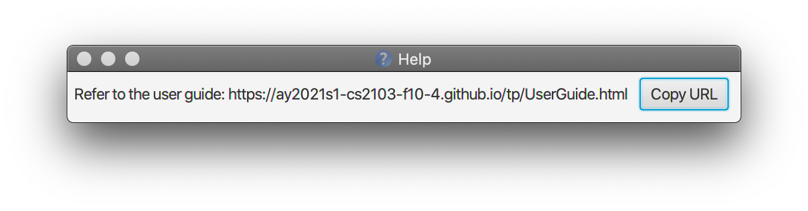

McScheduler is a **one-stop solution for McDonald's Shift Managers** to manage shift scheduling, as well as worker
contacts and compensation, optimized for use via a **Command Line Interface** (CLI) while still having the benefits of a
**Graphical User Interface** (GUI). With the McScheduler, all information needed for shift-work assignment is made
easily available to streamline the work of McDonald's Shift Managers.

* Table of Contents
{:toc}

--------------------------------------------------------------------------------------------------------------------

## Quick start

1. Ensure you have Java `11` or above installed on your computer.

1. Download the latest `mcscheduler.jar` [here](https://github.com/AY2021S1-CS2103-F10-4/tp/releases).

1. Copy the file to the folder you wish to use as the _home folder_ for the McScheduler.

1. Double-click the file to start the app. The GUI (similar to the image below) should appear in a few seconds. The app
   contains some sample data. 
   

1. Type a command in the command box and press `Enter` to execute it. 
   e.g. Typing **`help`** and pressing `Enter` will open the help window. 
   Some example commands you can try:

   * **`worker-list`** : Lists all workers in the McScheduler.

   * **`worker-add`**` n/John hp/98765432 a/21 Lower Kent Ridge Rd, Singapore 119077 r/Cashier p/7` : Adds a cashier
   named John whose pay is $7/hr. His phone number is 98765432 and he lives at 21 Lower Kent Ridge Rd, Singapore 119077.

   * **`worker-delete`**` 3` : Deletes the 3rd worker shown in the worker list.

   * **`shift-add`**` d/Wed t/AM r/Cashier 2 r/Janitor 3` : Adds a Wednesday AM shift, which requires 2 workers to fill
   the cashier role and 3 workers to fill the janitor role.

   * **`assign`**` s/3 w/2 r/Cashier` : Assigns the 2nd worker on the list to the 3rd shift on the list as a cashier.

   * **`exit`** : Exits the app.

1. Refer to the [Features](#features) below for details of each command.

--------------------------------------------------------------------------------------------------------------------

## Features

**:information_source: Notes about the command format:** 

* Words in `UPPER_CASE` are the parameters to be supplied by the user. 
  e.g. in the command `worker-delete WORKER_INDEX`, `WORKER_INDEX` is a parameter for the index of the worker (in the
  worker list) you wish to delete from the application. The command can be used as `worker-delete 4`.

* Parameters in `[square brackets]` are optional. 
  e.g. `n/NAME [r/ROLE]` can be used as `n/John Doe r/Cashier` or as `n/John Doe`. `[u/UNAVAILABLE_DAY [UNAVAILABLE_TIME]]`
  can be used as ` ` (i.e. the entire parameter is not provided), as `u/Mon` (i.e. `UNAVAILABILITY_TIME` is not provided) or as `u/Mon am`.

* Parameters with `…`​ after them can be used multiple times. 
  e.g. `w/WORKER_INDEX` can be used as `w/1`, `w/1 w/2`, `w/1 w/2 w/3` etc.

* When `[square brackets]` are used with `…`​, parameters can be used multiple times including zero times. 
  e.g. `[r/ROLE NUMBER_NEEDED]…​` can be used as ` ` (i.e. 0 times), `r/Cashier 3`, `r/Cashier 1 r/Janitor 2` etc.

* Parameters in `{curly brackets}` are a set and should be used together.
  e.g. `{w/WORKER_INDEX ROLE}…​` should be used as `w/1 Cashier`, `w/1 Cashier w/2 Janitor w/3 Chef` etc.

* Parameters can be provided in any order, unless otherwise specified. 
  e.g. if the command specifies `n/NAME p/PHONE_NUMBER`, `p/PHONE_NUMBER n/NAME` is also acceptable.

### Viewing help: `help`

Shows a message explaining how to access the help page.

Format: `help`

### Adding a worker: `worker-add`

Adds a new worker to the McScheduler.

Format: `worker-add n/NAME hp/PHONE_NUMBER a/ADDRESS p/HOURLY_PAY [r/ROLE]... [u/UNAVAILABLE_DAY [UNAVAILABLE_TIME]]...`

* Adds a worker with the specified `NAME`, `PHONE_NUMBER`, `ADDRESS`, `HOURLY_PAY` and `ROLE`(s).
* `HOURLY_PAY` must be a **positive number not exceeding 1000**, with a maximum of 2 decimal places.
* We allow the workers to share `PHONE_NUMBER` and `ADDRESS`.
* The `PHONE_NUMBER` has to be a **valid Singapore phone number** (8 digits, starting with 6, 8 or 9 only). 
* The worker will be fit to take on the specified `ROLE`(s) in a shift. The specified `ROLE`(s) must be an existing role
  in the McScheduler. A role can be added to the McScheduler using the [role-add](#adding-a-role-role-add) command.
* `UNAVAILABLE_DAY` should take one of these values: **Mon, Tue, Wed, Thu,
Fri, Sat, Sun**. These values are case-insensitive (i.e. `Mon`, `MON`, `mon` etc. are all accepted).
* `UNAVAILABLE_TIME` is optional but should take one of these values if specified: **AM, PM**. These values are case-insensitive (i.e. `aM`, `Pm`, `PM`, etc. are all
accepted).
* The worker will be unavailable for the entire day if no `UNAVAILABLE_TIME` is specified. Else, they will be unavailable on the specified `UNAVAILABLE_DAY` at the specified
`UNAVAILABLE_TIME`.

:bulb: **Tip:**

A worker can be fit for any number of roles (including zero) that can be added by multiple `r/` parameters.
A worker can have any number of unavailable timings (including zero) that can be added by multiple `u/` parameters.

Examples:
* `worker-add n/John hp/98765432 a/21 Lower Kent Ridge Rd, Singapore 119077 r/Cashier p/7` Adds a cashier named John
  whose pay is $7/hr. His phone number is 98765432 and he lives at 21 Lower Kent Ridge Rd, Singapore 119077.

* `worker-add n/Tom hp/87654321 a/22 Bong Keng Road, #01–01 r/Burger Flipper r/Janitor p/7.50 u/Mon AM` Adds a worker named Tom
  who is fit to be a burger flipper or a janitor, and whose pay is $7.50/hr. His phone number is 87654321 and he lives
  at Bong Keng Road, #01–01. He is unavailable for work on Monday mornings.

### Listing all workers: `worker-list`

Shows a list of all workers in the McScheduler, including their contacts, hourly pay, assigned shifts and unavailable
timings.

Format: `worker-list`

### Editing a worker: `worker-edit`

Edits an existing worker in the McScheduler.

Format: `worker-edit WORKER_INDEX [n/NAME] [hp/PHONE_NUMBER] [a/ADDRESS] [p/HOURLY_PAY] [r/ROLE]... [u/UNAVAILABLE_DAY [UNAVAILABLE_TIME]]...`

* Edits the worker at the specified `WORKER_INDEX`. The worker index refers to the index number shown in the displayed
  worker list. The worker index **must be a positive integer** i.e. 1, 2, 3, …​
* At least one of the optional fields must be provided.
* Existing values will be updated to the input values.
* `HOURLY_PAY` must be a **positive number not exceeding 1000**, with a maximum of 2 decimal places.
* We allow the workers to share `PHONE_NUMBER` and `ADDRESS`.
* The `PHONE_NUMBER` has to be a **valid Singapore phone number** (8 digits, starting with 6, 8 or 9 only). 
* When editing roles, the existing roles of the worker will be removed i.e adding of roles is not cumulative.
* The specified `ROLE`(s) must be an existing role in the McScheduler. A role can be added to the McScheduler using the
  [role-add](#adding-a-role-role-add) command.
* When editing unavailabilities, the existing unavailabilities of the worker will be removed i.e. adding of unavailabilities is not cumulative.
* `UNAVAILABLE_DAY` should take one of these values: **Mon, Tue, Wed, Thu,
Fri, Sat, Sun**. These values are case-insensitive (i.e. `Mon`, `MON`, `mon` etc. are all accepted).
* `UNAVAILABLE_TIME` is optional but should take one of these values if specified: **AM, PM**. These values are case-insensitive (i.e. `aM`, `Pm`, `PM`, etc. are all
accepted).
* The edited worker will be unavailable for the entire day if no `UNAVAILABLE_TIME` is specified. Else, they will be unavailable on the specified `UNAVAILABLE_DAY` at the specified
`UNAVAILABLE_TIME`.

:bulb: **Tip:**

You can remove all of a worker’s roles by typing `r/` without specifying any roles after it.

Examples:
* `worker-edit 1 n/John r/Janitor` Edits the name and role of the 1st worker to be John and janitor respectively.

* `worker-edit 2 n/Betsy Crower p/7 u/Mon` Edits the name, pay and unavailable timings of the 2nd worker to be Betsy Crower, $7/hr and Mondays respectively.

### Locating workers by name: `worker-find`

Finds workers whose names contain any of the given keywords.

Format: `worker-find KEYWORD [MORE_KEYWORDS]`

* The search is case-insensitive. e.g. `hans` will match `Hans`
* The order of the keywords does not matter. e.g. `Hans Bo` will match `Bo Hans`
* Only the name is searched.
* Only full words will be matched e.g. `Han` will not match `Hans`
* Workers matching at least one keyword will be returned (i.e. `OR` search).
  e.g. `Hans Bo` will return `Hans Gruber`, `Bo Yang`

Examples:
* `worker-find John` returns `john` and `John Doe`

* `worker-find alex david` returns `Alex Yeoh` and `David Li`

### Deleting a worker: `worker-delete`

Deletes a worker from the McScheduler.

Format: `worker-delete WORKER_INDEX`

* Deletes the worker at the specified `WORKER_INDEX`. The index refers to the index number shown in the displayed worker
  list. The worker index **must be a positive integer** i.e. 1, 2, 3, …​

Example:
* `worker-delete 4` Deletes the 4th worker shown in the worker list.

### Calculating a worker's pay for the week: `worker-pay`

Calculates a worker's pay for the week.

Format: `worker-pay WORKER_INDEX`

* Calculates the total pay for the week for the worker at the specified `WORKER_INDEX`. The index refers to the index
  number shown in the displayed worker list. The worker index **must be a positive integer** i.e. 1, 2, 3, …​
* Each AM and PM shift is 8 hours long. 

Example:
* `worker-pay 4` Calculate the total pay for the week for the 4th worker shown in the worker list.

### Adding a shift: `shift-add`

Adds a new shift to the McScheduler.

Format: `shift-add d/DAY t/TIME [r/ROLE NUMBER_NEEDED]...`

* Adds a shift on the specified `DAY` at the specified `TIME`.
* The day specified should take one of these values: **Mon, Tue, Wed, Thu, Fri, Sat, Sun**. These values are case-
  insensitive i.e. `Mon`, `MON`, `mon` etc. are all accepted.
* The time specified should take one of these values: **AM, PM**. These values are case-insensitive i.e. `am`, `AM`,
  `aM` and `Am` are all accepted.
* The shift will require worker(s) to fill the specified `ROLE`(s). The specified `ROLE`(s) must be an existing role in
  the McScheduler. A role can be added to the McScheduler using the [role-add](#adding-a-role-role-add) command.
* Each role should be accompanied by the `NUMBER_NEEDED` to fill that role. This number **must be a positive integer**
  with no leading zeroes i.e. 1, 2, 3, …​
* `NUMBER_NEEDED` **must not exceed 50** i.e. there can only be at most 50 workers for each role.

Examples:
* `shift-add d/Wed t/AM r/Cashier 2 r/Janitor 3` Adds a Wednesday AM shift, which requires 2 workers to fill the cashier
  role and 3 workers to fill the janitor role.

* `shift-add d/MON t/pM` Adds a Monday PM shift with no required roles yet.

### Listing all shifts: `shift-list`

Shows a list of all shifts in the McScheduler, including the roles needed and workers assigned to each shift.

Format: `shift-list`

### Locating shifts by day or time: `shift-find`

Finds shifts whose day or time contain any of the given keywords.

Format: `shift-find KEYWORD [MORE_KEYWORDS]`

* The search is case-insensitive. e.g. `mon` will match `MON`
* Only the day and time are searched.
* Only full words will be matched e.g. `m` will not match `MON`
* Workers matching at least one keyword will be returned (i.e. `OR` search).
  e.g. `MON AM` will return a `TUE AM` shift and a `MON PM` shift

Examples:
* `shift-find Fri PM` returns all shifts on Friday and all PM shifts. i.e. `FRI PM`, `THU PM` and `FRI AM` shift will all be returned

* `shift-find Mon` returns a `MON AM` shift and a `MON PM` shift

* `shift-find AM PM` returns all shifts

### Editing a shift: `shift-edit`

Edits the details of an existing shift in the McScheduler.

Format: `shift-edit SHIFT_INDEX [d/DAY] [t/TIME] [r/ROLE NUMBER_NEEDED]...`

* Edits the shift at the specified `SHIFT_INDEX`. The shift index refers to the index number shown in the displayed
  shift list. The shift index **must be a positive integer** i.e. 1, 2, 3, …​
* At least one of the optional fields must be provided.
* Existing values will be updated to the input values.
* Existing role requirements will be **overwritten** by the new role requirements.
* The day specified should take one of these values: **Mon, Tue, Wed, Thu, Fri, Sat, Sun**. These values are case-
  insensitive i.e. `Mon`, `MON`, `mon`, `mOn` etc. are all accepted.
* The time specified should take one of these values: **AM, PM**. These values are case-insensitive i.e. `am`, `AM`,
  `aM` and `Am` are all accepted.
* The specified `ROLE`(s) must be an existing role in the McScheduler. A role can be added to the McScheduler using the
  [role-add](#adding-a-role-role-add) command.
* Each role should be accompanied by the `NUMBER_NEEDED` to fill that role. This number **must be a positive integer**
  with no leading zeroes i.e. 1, 2, 3, …​
* `NUMBER_NEEDED` **must not exceed 50** i.e. there can only be at most 50 workers for each role.

Examples:
* `shift-edit 3 r/Cashier 3 r/Janitor 2` Edits the 3rd shift on the list such that it now requires 3 cashiers and 2
  janitors.

* `shift-edit 1 d/Mon t/PM r/Janitor 1` Edits the 1st shift such that it is now a Monday PM shift, requiring 1 janitor.

* `shift-edit 2 r/` Edits the 2nd shift such that it now has no required roles.

### Deleting a shift: `shift-delete`

Deletes a shift from the McScheduler.

Format: `shift-delete SHIFT_INDEX`

* Deletes the shift at the specified `SHIFT_INDEX`. The index refers to the index number shown in the displayed shift
  list. The shift index **must be a positive integer** i.e. 1, 2, 3, …​

Example:
* `shift-delete 2` Deletes the 2nd shift on the list.

### Adding a role: `role-add`

Adds a new role to the McScheduler.

Format: `role-add ROLE`

* Adds the specified `ROLE` to the McScheduler. The specified `ROLE` should be alphanumeric and can contain spaces.

Examples:
* `role-add cashier` Adds a cashier role.

* `role-add Storey 2 server` Adds a storey 2 server role.

### Editing a role: `role-edit`

Edits an existing role in the McScheduler.

Format: `role-edit ROLE_INDEX ROLE`

* Edits the role at the specified `ROLE_INDEX`. The role index refers to the index number shown in the displayed role
  list. The role index **must be a positive integer** i.e. 1, 2, 3, …​
* The specified `ROLE` should be alphanumeric and can contain spaces.

Example:
* `role-edit 1 burger flipper` Edits the 1st role to be burger flipper.

### Deleting a role: `role-delete`

Deletes a role from the McScheduler.

Format: `role-delete ROLE_INDEX`

* Deletes the role at the specified `ROLE_INDEX`. The index refers to the index number shown in the role list displayed.
  The role index **must be a positive integer** i.e. 1, 2,
  3, …​

Example:
* `role-delete 3` Deletes the 3rd role shown in the role list.

### Listing all available workers for a shift and role: `worker-avail`

Shows a list of all workers who are available for a particular shift under a particular role.

Format: `worker-avail SHIFT_INDEX r/ROLE`

* Shows a list of available workers who can work as the specified `ROLE` for the shift at the specified `SHIFT_INDEX`.
  The index refers to the index number shown in the displayed shift list. The shift index **must be a positive integer**
  i.e. 1, 2, 3, …​
* `ROLE` must be a valid role that has already been added to the list of approved roles. See [role-add](#adding-a-role-role-add).

Example:
* `worker-avail 4 r/Chef` Show a list of available workers who can work as chefs for the 4th shift shown in the shift list.

### Assigning a worker to a role in a shift: `assign`

Assigns an existing worker to take on an existing role in an existing shift.

Format: `assign s/SHIFT_INDEX {w/WORKER_INDEX ROLE}...`

* Assigns the worker(s) at the specified `WORKER_INDEX` to the shift at the specified `SHIFT_INDEX`. The indexes refer to
  the index numbers shown in the displayed worker and shift lists. The indexes **must be positive integers** i.e. 1, 2,
  3, …​
* The assigned worker(s) will fill up the specified `ROLE` in the shift. The worker(s) must be fit for the specified `ROLE`
  and the shift must require the `ROLE`.

Example:
* `assign s/3 w/2 Cashier` Assigns the 2nd worker on the worker list to the 3rd shift on the shift list as a cashier.
* `assign s/3 w/2 Cashier w/3 Chef` Assigns the 2nd worker as a cashier and the 3rd worker as a chef to the 3rd shift.

### Removing a worker from a shift: `unassign`

Removes a worker from a particular shift.

Format: `unassign s/SHIFT_INDEX w/WORKER_INDEX...`

* Unassigns the worker(s) at the specified `WORKER_INDEX` from the shift at the specified `SHIFT_ INDEX`. The indexes refer
  to the index numbers shown in the displayed worker and shift lists. The indexes **must be positive integers** i.e. 1,
  2, 3, …​
 
### Reassigning an existing assignment: `reassign`

Reassigns an existing assignment in the McScheduler, similar to an assignment edit.

Format: `reassign so/OLD_SHIFT_INDEX wo/OLD_WORKER_INDEX sn/NEW_SHIFT_INDEX wn/NEW_WORKER_INDEX r/ROLE`

* Reassigns an existing assignment using the indexes provided such that the worker at `NEW_WORKER_INDEX` will be assigned to the
shift at `NEW_SHIFT_INDEX` for the specified `ROLE`. The indexes **must be positive integers** i.e. 1,2, 3, …​
* The old assignment involving the worker at the specified `OLD_WORKER_INDEX` and the shift at `OLD_SHIFT_INDEX` must exist.
The old assignment will be edited during a successful `reassign` call.
* The `OLD_WORKER_INDEX` can be the same as the `NEW_WORKER_INDEX`. The `OLD_SHIFT_INDEX` can be the same as the `NEW_SHIFT_INDEX`.
This allows workers to be reassigned to the same shift but under a different `ROLE`.
* No reassignment will be made if there already exists a duplicate assignment in the McScheduler.

Examples:
* `reassign so/4 wo/1 sn/4 wn/2 r/Chef` Reassigns the 2nd worker on the worker list to the 4th shift on the shift list as a Chef.

* `reassign so/1 wo/2 sn/3 wn/2 r/Cashier` Reassigns the 2nd worker on the worker list to the 3rd shift on the shift list as a Cashier.

### Assigning a worker to take leave during a shift: `take-leave`

Assigns a worker to take leave at a particular day and time, as indicated by a shift.

Format: `take-leave s/SHIFT_INDEX w/WORKER_INDEX...`

* Assigns worker(s) to take leave on the shift at the specified `SHIFT_INDEX` in the shift list. The worker(s) taking leave
will be the worker(s) at the specified `WORKER_INDEX` in the worker list.
* The order of specifying does not matter, as long as 's/' is attached to the `SHIFT_INDEX` and 'w/' is attached to the
`WORKER_INDEX`.   e.g. `take-leave s/4 w/1` is equivalent to `take-leave w/1 s/4`.
* An error message will be shown if any of the workers are unavailable for that shift, since there is no reason to take leave then.

Example:
* `take-leave s/4 w/1` Assigns the 1st worker to take leave during the 4th shift.
* `take-leave s/4 w/1 w/3` Assigns the 1st and 4rd worker to take leave during the 4th shift.

### Assigning a worker leave over a range of days and times: `mass-take-leave`

Assigns a worker to take leave over a range of days and times given a start and end day/time.

Format: `mass-take-leave w/WORKER_INDEX d/START_DAY t/START_TIME d/END_DAY t/END_TIME`

* Assigns a worker to take leave on all shifts between the specified `START_DAY` and `START_TIME` to `END_DAY` and
`END_TIME`. The worker taking leave will be the worker at the specified `WORKER_INDEX` in the worker list.
* The order of specifying **does matter** between the two sets of days and times (i.e. `START_DAY` must come before `END_DAY`
and similarly for time). Specifying in the wrong order is likely to result in leave taken in the wrong shifts.
* However, the order does not matter for all other arguments.   e.g. `mass-take-leave w/2 d/MON t/AM d/FRI t/PM` is
the same as `mass-take-leave t/AM t/PM d/MON d/FRI w/2`, though the latter syntax is not recommended.
* The day/time range will loop properly between Sunday and Monday. Hence `mass-take-leave w/2 d/SUN t/AM d/MON t/AM` will
work as intended - leave taken on Sunday morning to Monday morning.
* Shifts will be created for all day and time combinations within the specified range that does not have a shift already
present within the McScheduler. These shifts will have no role requirements.
* While the command will still go through, a warning message will be shown when the worker has an assigned role in any one of the shifts within the day/time range.
  
Examples:
* `mass-take-leave w/2 d/MON t/PM d/THU t/PM` Assigns the 2nd worker to take leave from MON PM shift to THU PM shift (inclusive).

* `mass-take-leave w/1 d/THU t/PM d/MON t/PM` Assigns the 1st worker to take leave from THU PM shift to MON PM shift (inclusive).

### Cancelling a worker's leave for a shift: `cancel-leave`

Cancels a worker's leave at a particular day and time, as indicated by a shift.

Format `cancel-leave s/SHIFT_INDEX w/WORKER_INDEX...`

* Cancel's worker(s)' leave on the shift at the specified `SHIFT_INDEX` in the shift list. The worker whose leave is
cancelled will be the worker(s) at the specified `WORKER_INDEX` in the worker list.
* The order of specifying does not matter, as long as 's/' is attached to the `SHIFT_INDEX` and 'w/' is attached to the
`WORKER_INDEX`.   e.g. `cancel-leave s/4 w/1` is equivalent to `cancel-leave w/1 s/4`.
* An error message will be shown in the following situations:
  * No leave found for the worker(s) at the specified shift.
  * An assignment other than leave is found for the worker(s) at the specified shift.
 
Examples:
* `cancel-leave s/4 w/1` Cancels the leave of the 1st worker for the 4th shift.
* `cancel-leave s/4 w/1 w/3` Cancels the leave of the 1st and the 3rd worker for the 4th shift.

### Cancelling a worker's leave over a range of days and times: `mass-cancel-leave`

Cancels a worker's leave over a range of days and times given a start and end day/time.

Format: `mass-cancel-leave w/WORKER_INDEX d/START_DAY t/START_TIME d/END_DAY t/END_TIME`

* Cancels a worker's leave on all shifts between the specified `START_DAY` and `START_TIME` to `END_DAY` and
`END_TIME`. The worker cancelling leave will be the worker at the specified `WORKER_INDEX` in the worker list.
* The order of specifying **does matter** between the two sets of days and times (i.e. `START_DAY` must come before `END_DAY`
and similarly for time). Specifying in the wrong order is likely to result in leave cancelled in the wrong shifts.
* However, the order does not matter for all other arguments.   e.g. `mass-cancel-leave w/2 d/MON t/AM d/FRI t/PM` is
the same as `mass-cancel-leave t/AM t/PM d/MON d/FRI w/2`, though the latter syntax is not recommended.
* The day/time range will loop properly between Sunday and Monday. Hence `mass-cancel-leave w/2 d/SUN t/AM d/MON t/AM` will
work as intended - leave cancelled from Sunday morning to Monday morning.
* An error message will be shown in the following situations:
  * The worker has no leave in the given day/time range.
 
Examples:
* `mass-cancel-leave w/2 d/MON t/PM d/THU t/PM` Cancels the 2nd worker's leave between MON PM shift to THU PM shift (inclusive).

* `mass-cancel-leave w/1 d/THU t/PM d/MON t/PM` Cancels the 1st worker leave between THU PM shift to MON PM shift (inclusive).

### Exiting the program : `exit`

Exits the program.

Format: `exit`

### Saving the data

McScheduler data are saved in the hard disk automatically after any command that changes the data. There is no need to
save manually.

--------------------------------------------------------------------------------------------------------------------

## FAQ

**Q**: How do I transfer my data to another Computer? 
**A**: Install the app in the other computer and overwrite the empty data file it creates with the file that contains
the data of your previous McScheduler home folder.

--------------------------------------------------------------------------------------------------------------------

## Command summary

Data | Action | Format, Example
-----|--------|------------------
Worker | **Add** | `worker-add n/NAME hp/PHONE_NUMBER a/ADDRESS p/HOURLY_PAY [r/ROLE]... [u/UNAVAILABLE_DAY [UNAVAILABLE_TIME]]...` e.g. `worker-add n/John hp/98765432 a/21 Lower Kent Ridge Rd, Singapore 119077 r/Cashier p/7 u/Mon am`
Worker | **Delete** | `worker-delete WORKER_INDEX` e.g. `worker-delete 4`
Worker | **Edit** | `worker-edit WORKER_INDEX [n/NAME] [hp/PHONE_NUMBER] [a/ADDRESS] [p/HOURLY_PAY] [r/ROLE]... [u/UNAVAILABLE_DAY [UNAVAILABLE_TIME]]...` e.g. `worker-edit 2 n/Betsy Crower p/7 u/Mon`
Worker | **List** | `worker-list`
Worker | **Find** | `worker-find KEYWORD [MORE_KEYWORDS]` e.g. `worker-find alex david`
Worker | **Pay** | `worker-pay WORKER_INDEX` e.g. `worker-pay 1`
Shift | **Add** | `shift-add d/DAY t/TIME [r/ROLE NUMBER_NEEDED]...` e.g. `shift-add d/Wed t/AM r/Cashier 2 r/Janitor 3`
Shift | **Delete** | `shift-delete SHIFT_INDEX` e.g. `shift-delete 2`
Shift | **Edit** | `shift-edit SHIFT_INDEX [d/DAY] [t/TIME] [r/ROLE NUMBER_NEEDED]...` e.g. `shift-edit 1 d/Mon t/PM r/Janitor 1`
Shift | **List** | `shift-list`
Shift | **Find** | `shift-find KEYWORD [MORE_KEYWORDS]` e.g. `shift-find Fri PM`
Role | **Add** | `role-add ROLE` e.g. `role-add Storey 2 server`
Role | **Delete** | `role-delete ROLE_INDEX` e.g. `role-delete 3`
Assignment | **Show Available Workers** | `worker-avail SHIFT_INDEX r/ROLE` e.g. `worker-avail 1 r/Chef`
Assignment | **Assign** | `assign s/SHIFT_INDEX {w/WORKER_INDEX ROLE}...` e.g. `assign s/3 w/2 Cashier w/3 Chef`
Assignment | **Unassign** | `unassign s/SHIFT_INDEX w/WORKER_INDEX...` e.g. `unassign s/4 w/1 w/5`
Assignment | **Reassign** | `reassign so/OLD_SHIFT_INDEX wo/OLD_WORKER_INDEX sn/NEW_SHIFT_INDEX wn/NEW_WORKER_INDEX` e.g. `reassign so/4 wo/1 sn/1 wn/1 r/Chef`
Leave | **Take** | `take-leave s/SHIFT_INDEX w/WORKER_INDEX...` e.g. `take-leave s/2 w/1 w/4`
Leave | **Take over range of dates** | `mass-take-leave w/WORKER_INDEX d/START_DAY t/START_TIME d/END_DAY t/END_TIME` e.g. `mass-take-leave w/2 d/Sat t/AM d/Tue t/PM`
Leave | **Cancel** | `cancel-leave s/SHIFT_INDEX w/WORKER_INDEX...` e.g.`cancel-leave s/3 w/2 w/3`
Leave | **Cancel over a range of dates** | `mass-cancel-leave w/WORKER_INDEX d/START_DAY t/START_TIME d/END_DAY t/END_TIME`  e.g. `mass-cancel-leave w/3 d/Mon t/AM d/Mon t/PM`
General | **Help** | `help`
General | **Exit** | `exit`
